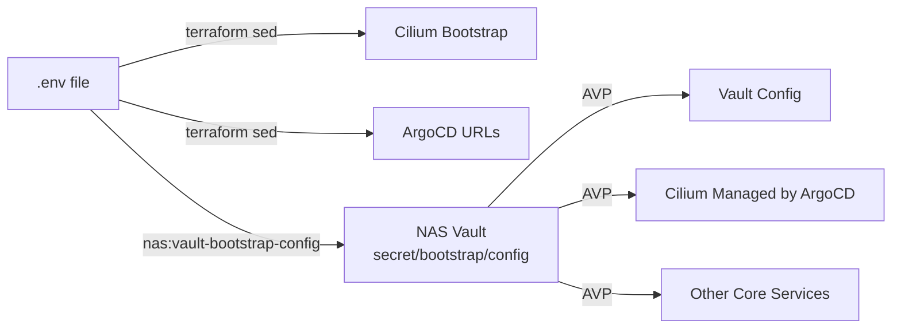

# ArgoCD Vault Plugin Bootstrap Flow

This document explains how configuration values flow from `.env` to the cluster.

## Overview

The project uses a dual approach for configuration:
1. **Bootstrap phase**: Terraform uses local `.global-config.yaml.tmp` for initial setup
2. **Runtime phase**: ArgoCD Vault Plugin (AVP) uses NAS Vault for all values

## Configuration Flow



## Why Both Approaches?

1. **Terraform Bootstrap Needs**:
   - Cilium must be installed before ArgoCD (CNI requirement)
   - ArgoCD URL configuration needs domain before it starts
   - These happen BEFORE AVP is available

2. **GitOps Runtime Needs**:
   - All config should come from Git (no local files)
   - Values should be dynamic (from Vault via AVP)
   - No drift between Git and cluster state

## Bootstrap Process

```bash
# 1. Create .env file with all ARGO_ variables
cp .env.example .env
vim .env

# 2. Deploy NAS services and configure bootstrap
task nas:deploy
task nas:vault-transit          # Setup transit unseal for K8s vault
task nas:vault-bootstrap-config # Convert .env → NAS Vault

# 3. Deploy cluster (uses both approaches)
cd terraform && ./deploy-auto-discover-fast.sh
# - Bootstraps Cilium with sed (directly from .env)
# - Installs ArgoCD with sed (directly from .env)
# - ArgoCD+AVP takes over using NAS Vault
```

## Key Files

- `.env`: Single source of truth for all configuration
- `secret/bootstrap/config` in NAS Vault: Runtime configuration for AVP

## Important Notes

1. Terraform reads directly from `.env` for bootstrap values
2. Once ArgoCD is running, all values come from NAS Vault via AVP
3. The homelab-values repo is NO LONGER NEEDED for configuration
4. All ARGO_ variables in .env are automatically available to AVP
5. The bootstrap config setup is now a separate step for clarity