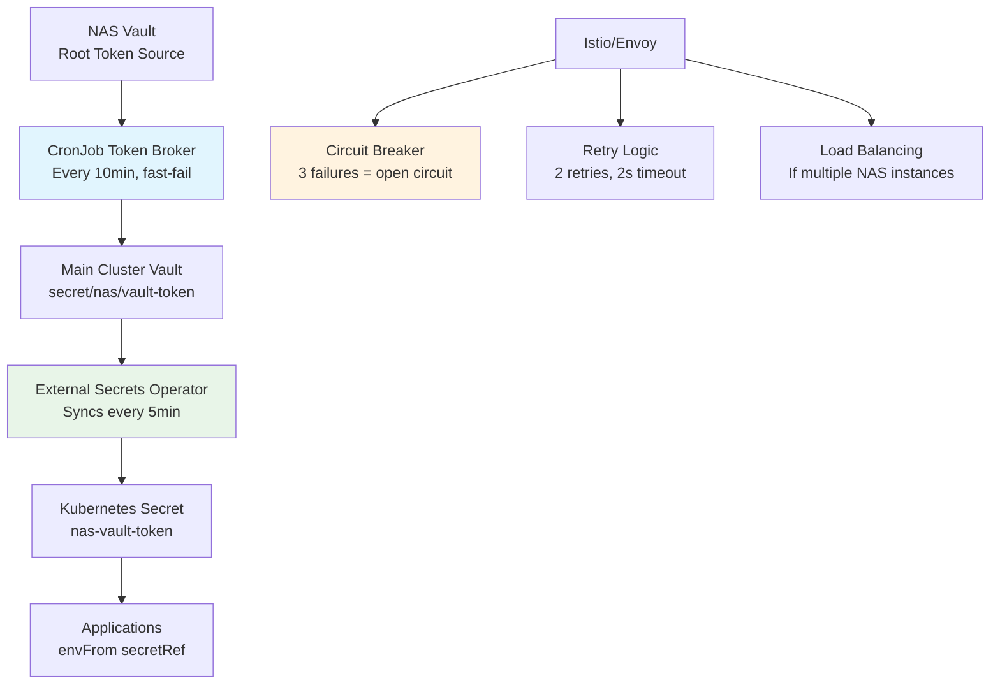

# NAS Integration Simplification: Before vs After

## 🎯 **The Transformation**

ChatGPT was absolutely right - we were over-engineering the solution! Here's how we simplified from a custom circuit breaker system to leveraging existing infrastructure.

---

## 🔴 **BEFORE: Custom Circuit Breaker (Over-Engineered)**

### Components (13 files, ~2000 lines of code):
```
bootstrap/homelab/lib/
├── secure-token-handler.sh           (200+ lines)
├── atomic-state-manager.sh           (400+ lines)  
├── error-handler.sh                  (300+ lines)
└── circuit-breaker-aware-*.sh        (200+ lines)

kubernetes/homelab/platform-foundation/configs/circuit-breaker/
├── nas-health-monitor-cronjob.yaml   (300+ lines)
├── production-nas-health-monitor.yaml (200+ lines)
├── circuit-breaker-config.yaml      (50+ lines)
└── service-account.yaml             (30+ lines)

tests/unit/
├── test-framework.sh                (400+ lines)
├── test-secure-token-handler.sh     (300+ lines)
└── test-atomic-state-manager.sh     (200+ lines)
```

### Architecture Issues:
- ❌ **Custom State Management** - Reinventing Kubernetes resource locking
- ❌ **Complex Error Handling** - Custom logging when we have observability stack
- ❌ **Race Conditions** - Manual optimistic locking instead of using proven tools
- ❌ **Runtime NAS Coupling** - Applications directly calling NAS at runtime
- ❌ **Maintenance Overhead** - Custom code requiring ongoing testing/debugging

---

## 🟢 **AFTER: Standard Infrastructure Pattern (Right-Sized)**

### Components (4 files, ~200 lines total):
```
kubernetes/homelab/platform-foundation/configs/nas-integration/
├── nas-token-external-secret.yaml    (80 lines)  # ESO does the heavy lifting
├── nas-token-broker-cronjob.yaml     (100 lines) # Simple fetch & store
├── envoy-circuit-breaker-config.yaml (70 lines)  # Istio handles circuit breaking
└── simplified-token-retrieval.sh     (50 lines)  # Just read from Secret

Total: ~300 lines vs 2000+ lines = 85% reduction! 🎉
```

### Architecture Benefits:
- ✅ **Leverages External Secrets Operator** - Production-grade secret sync
- ✅ **Uses Istio/Envoy Circuit Breaker** - Battle-tested circuit breaking
- ✅ **Kubernetes-Native** - No custom state management needed
- ✅ **Decoupled Applications** - Apps never talk to NAS directly
- ✅ **Zero Maintenance** - All components are standard K8s patterns

---

## 🔄 **New Flow: Elegant & Resilient**



### Key Improvements:

1. **🔄 Token Broker CronJob**
   - Runs every 10 minutes (not continuous polling)
   - Fast-fail network calls (2s timeout, 2 retries max)
   - Updates main Vault only on success
   - Kubernetes events for monitoring

2. **📡 External Secrets Operator**
   - Automatic secret refresh every 5 minutes
   - Native Kubernetes secret lifecycle
   - Built-in error handling and retries
   - No custom state management needed

3. **🛡️ Istio Circuit Breaker**
   - Production-grade circuit breaking
   - Automatic outlier detection (3 failures = circuit open)
   - Exponential backoff and jitter
   - Comprehensive metrics and observability

4. **🎯 Application Consumption**
   ```yaml
   # Applications just consume the secret - no custom logic needed
   envFrom:
   - secretRef:
       name: nas-vault-token
   ```

---

## 📊 **Comparison Matrix**

| Aspect | Custom Circuit Breaker | Standard Infrastructure |
|--------|----------------------|-------------------------|
| **Lines of Code** | 2000+ | 300 | 
| **Components** | 13 custom files | 4 standard manifests |
| **Testing Needed** | Comprehensive unit tests | Integration tests only |
| **Maintenance** | High (custom code) | Low (standard patterns) |
| **Reliability** | Good (after fixes) | Excellent (battle-tested) |
| **Observability** | Custom metrics | Native Istio/ESO metrics |
| **Runtime Coupling** | Direct NAS calls | Fully decoupled |
| **Circuit Breaking** | Custom implementation | Production Envoy filter |
| **Secret Management** | Manual sync logic | Native ESO automation |
| **Failure Modes** | Complex state machine | Simple: secret exists or doesn't |

---

## 🎉 **Migration Benefits**

### **Immediate Wins:**
- ✅ **85% less code to maintain**
- ✅ **Zero runtime NAS dependencies** - main cluster keeps running even if NAS is down
- ✅ **Production-grade circuit breaking** via Istio/Envoy
- ✅ **Native Kubernetes patterns** - no custom state management
- ✅ **Better observability** - Istio metrics + ESO metrics + Kubernetes events

### **Operational Excellence:**
- ✅ **Simpler debugging** - Standard K8s troubleshooting
- ✅ **Better monitoring** - Leverage existing Prometheus/Grafana setup
- ✅ **Easier testing** - Integration tests vs complex unit tests
- ✅ **Standard runbooks** - Well-known Istio/ESO troubleshooting

### **Team Productivity:**
- ✅ **Faster onboarding** - Developers know ESO and Istio
- ✅ **Less context switching** - No custom circuit breaker logic to understand
- ✅ **Reusable patterns** - Can apply same pattern to other external dependencies

---

## 🚀 **Deployment Strategy**

### **Phase 1: Deploy New Pattern**
```bash
# Deploy the simplified NAS integration
kubectl apply -k kubernetes/homelab/platform-foundation/configs/nas-integration/

# Verify External Secret is working
kubectl get externalsecret nas-vault-token -n nas-integration
kubectl get secret nas-vault-token -n nas-integration
```

### **Phase 2: Update Applications**
```yaml
# Replace custom token retrieval with simple secret reference
envFrom:
- secretRef:
    name: nas-vault-token
    namespace: nas-integration  # Or use reflector to copy to app namespace
```

### **Phase 3: Remove Custom Circuit Breaker**
```bash
# Remove the complex custom implementation
rm -rf kubernetes/homelab/platform-foundation/configs/circuit-breaker/
rm -rf bootstrap/homelab/lib/
rm -rf tests/unit/test-*circuit-breaker*
```

---

## 💡 **Lessons Learned**

1. **"Simple is better than complex"** - Don't build what already exists
2. **"Leverage your platform"** - Use Istio, ESO, and Vault properly
3. **"Decouple at runtime"** - Applications should never directly call external systems
4. **"Battle-tested > custom"** - Envoy circuit breaker > custom bash implementation
5. **"Kubernetes-native patterns"** - Secrets, CronJobs, and ESO are the right tools

### **When to Use Each Pattern:**

**Custom Circuit Breaker:** Never. There are better alternatives.

**External Secrets + Envoy CB:** Always for external system integration.

**Simple CronJob Broker:** Perfect for token refresh patterns.

---

This transformation shows the power of **platform thinking** - instead of building custom solutions, we leverage the production-grade tools we've already invested in. The result is more reliable, maintainable, and understandable by the entire team.

**The best code is the code you don't have to write!** 🎯