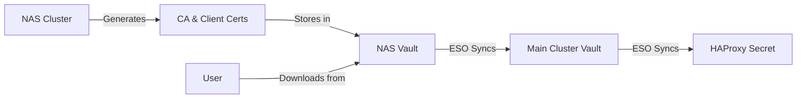

# New mTLS Architecture - NAS-based Certificate Management

## Architecture Overview



## Benefits

1. **Centralized Management**: All certificate operations happen in NAS cluster
2. **Automated Distribution**: ESO handles CA propagation
3. **Self-Service**: Users can download their certs via CLI
4. **Audit Trail**: All cert operations logged in Vault

## Implementation Plan

### Phase 1: NAS Certificate Authority

1. Create certificate generation job in NAS deployment
2. Store CA and client certs in NAS Vault paths:
   - `secret/pki/ca` - CA certificate and key
   - `secret/pki/clients/<username>` - Client certificates

### Phase 2: Cross-Cluster Sync

1. Configure ESO in main cluster to pull from NAS Vault
2. Create ExternalSecret for CA sync:
   - Source: `nas-vault-backend` (new ClusterSecretStore)
   - Path: `secret/pki/ca`
   - Target: Main cluster Vault at `secret/client-ca`

### Phase 3: Client Certificate Distribution

1. Create Vault policy for user cert access
2. Implement download command:
   ```bash
   # Output from nas:deploy
   echo "Download your certificate:"
   echo "vault kv get -field=p12 secret/pki/clients/$USERNAME | base64 -d > $USERNAME.p12"
   ```

## Technical Considerations

### Security
- NAS Vault must be hardened (transit unseal, audit logs)
- Network policies between clusters
- RBAC for certificate generation

### High Availability
- Main cluster can operate with cached CA
- Consider backup sync mechanism
- Document manual fallback procedures

### Monitoring
- Alert on sync failures
- Certificate expiration warnings
- Audit log analysis

## Migration Strategy

1. Deploy new system in parallel
2. Test with new client certificates
3. Migrate existing users gradually
4. Deprecate old local generation scripts

## Future Enhancements

1. **Web Portal**: Self-service certificate management UI
2. **SCEP/EST**: Automated certificate enrollment
3. **Short-lived Certs**: Reduce validity to hours/days
4. **Certificate Transparency**: Log all issued certificates